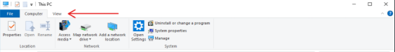
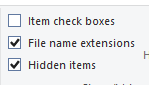

# WIP

## 01 - single cylinder engine

#### Intoduction

In this tutorial you will learn how to make a simple single cylinder engine completly from scratch. 

When you're actually making engines, it's generally preferable to simply modify other engines (LTSP created by Archangel Motors is a good example of engine templates made to be modified by users), however I belive it's important to understand the syntax of Piranha to be decent at making ES engines. Due to that this tutorial will cover every step necessary to get a simple 1 cylinder engine running in Engine Simulator.

In further tutorials you'll learn how to add other fetures, such as more cylinders, the vehicle model, and much more.

#### Creating the file

Engine Simulator engines are saved in a special file with the extention of .mr. We need to have that file to actually have a place to write code in, so let's make one.

Firstly you need to be able to edit file extentions, for that we need to see these extentions, so let's enable that.

In file explorer go into the view tab:

In that tab you want to make sure "File name extentions" is checked

Once you have that, you want to create a text file by right clicking in the destination folder, and navigating to new -> text document

Then right click on the file, click rename, and change the last three letters (.txt) to .mr

#### Getting an editor

Now that we have the file, we need to be able to edit it. Technically it's possible to edit .mr files in the Windows notepad, however it's preferable to use an actual editor. Visual Studio Code is recomended, as it has syntax highlight for Piranha.

To install VS Code, you'll want to download the installer from [this webside](https://code.visualstudio.com/)

Once you have that installed, you also want to download the Piranha extention from [here](https://marketplace.visualstudio.com/items?itemName=EktoromSoftwareInc.piranha-extension)
